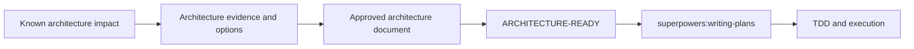

# Architecture-First Design

Produce an evidence-backed architecture document for an architecture-impacting change.
This is the high-risk design track of the Superpowers workflow, not a second task
orchestration system.

## Route and Handoff

Use this route when the change has a known architectural impact. If discovery has not yet
established that impact, use `superpowers:brainstorming` first; reuse its findings here
instead of creating a second specification.



- `DRAFT` and `IN REVIEW`: do not write product code, change configuration, create
  migrations, change APIs, invoke implementation skills, or invoke `writing-plans`.
- `ARCHITECTURE-READY`: the hard gate ends. Invoke `superpowers:writing-plans` next.
- The implementation plan must cite this document and must not reopen approved boundary,
  ownership, compatibility, or verification decisions without new evidence.

`attention-safe-orchestration` owns task identity and interruption policy. Architecture
document state is not the task status: keep the task in `PLANNING` during this track.
Only a blocking `Open Decisions` item may cause that wrapper to use
`NEEDS_HUMAN_DECISION`.

## Required Process

1. Read project constraints, baseline documentation, affected code, and recent changes.
   Record evidence separately from conclusions.
2. Identify owners, sources of truth, inputs/outputs, persistence, permissions,
   artifacts, failures, retries, and lifecycle boundaries.
3. Decompose independent subsystems; design only the first independently deliverable one.
4. Present two or three viable change shapes, including trade-offs and a recommendation.
5. Show the proposed boundary and revise it with the user before writing the document.
6. Create or update the architecture document below as `DRAFT` or `IN REVIEW`.
7. Perform the architecture review and development-readiness review; revise until both
   pass.
8. Ask the user to review the written document. Record blocking questions in
   `Open Decisions`; do not substitute a default.
9. Score the document. Mark it `ARCHITECTURE-READY` only with user approval, no blocking
   decision, and a score of at least 80/100; then hand off as above.

## Required Document

```markdown
# [Topic] Architecture Design

**Status:** DRAFT | IN REVIEW | ARCHITECTURE-READY
**Goal:** [one sentence]
**Non-goals:** [explicit exclusions]
**Decision:** [selected change shape]
**References:** [constraints, baseline docs, code paths]

## Architecture Diagrams

### Business Architecture
Use Mermaid `flowchart` for actors, business objects, decision ownership, and outcomes.

### System Interaction
Use Mermaid `sequenceDiagram` or `flowchart` for component calls, events, and data
boundaries.

### Core Flow
Use Mermaid for success, rejection, failure, retry, approval, or ordering behavior.

Explain beside every diagram: the decision it resolves, each node's responsibility,
the critical boundary, and unshown exceptions. Diagrams must agree with the contracts.

## Current Evidence
- [owner, source of truth, input/output, source]

## Proposed Boundary Contracts
- [owned and prohibited responsibilities]
- [API/event, persistence, permission, artifact contracts]

## Options
- [option, trade-off, selection or rejection]

## Compatibility and Recovery
- [preserved behavior, migration, retry, ordering, rollback, failure isolation]

## Verification Contracts
- [success, denial, failure, retry/idempotence, disabled behavior, environment variance]

## Open Decisions
- None, or [decision, owner, blocking reason]

## Revision History
| Date | Change |
| --- | --- |
| YYYY-MM-DD | Initial design |

## Readiness Score
| Dimension | Max | Score | Evidence or deduction |
| --- | ---: | ---: | --- |
| Evidence and traceability | 15 | [ ] | [ ] |
| Scope and decisions | 15 | [ ] | [ ] |
| Boundaries and contracts | 20 | [ ] | [ ] |
| Diagrams and explanations | 15 | [ ] | [ ] |
| Compatibility and recovery | 15 | [ ] | [ ] |
| Verification contracts | 15 | [ ] | [ ] |
| Governance and readability | 5 | [ ] | [ ] |
| **Total** | **100** | **[ ]** | **blocking gaps: [none/list]** |
```

## Reviews and Score Caps

Architecture review requires clear ownership and source of truth; allowed and prohibited
responsibilities; relevant protocol, persistence, artifact, permission, and lifecycle
boundaries; consistent diagrams; compatibility strategy; alternatives; and references.

Development-readiness review requires unambiguous scope; located affected modules and
interfaces; defined state/error/retry/recovery behavior; migration and release handling;
verification of success, denial, failure, retry/idempotence, disabled behavior, and
environment differences; and no unaccepted blocking decisions.

Score evidence/traceability, scope/decision closure, boundaries/contracts, diagrams,
compatibility/recovery, verification, and governance using the document table. A missing
required diagram or blocking decision caps the score at 69. Missing compatibility,
recovery, or verification contracts caps it at 79.

## Guardrails

- Do not begin from a desired design before checking existing contracts and owners.
- Do not create parallel registries, storage, permission, or event paths where an owner
  can be extended.
- Do not use vague handling language to conceal a blocking decision.
- Do not mark the document ready while a decision can alter a boundary, data model,
  lifecycle, compatibility strategy, or verification contract.
- Do not expand an approved document unless new evidence changes a boundary, risk
  control, or verification contract.
